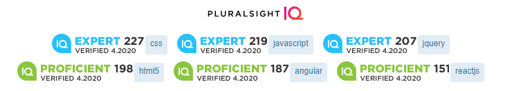

# algorithms-and-code-challenges

## About
- This repository was created to help me continue to grow and improve on my JavaScript, jQuery, and analytical skills everyday.
- Below are a variety of code challenges, SQL query practice, and interview coding questions I have faced in real life interviews

## Sites Used:
- Edabit
- CodeSignal Interview Questions
- Codewars
- leetcode
- 85 essential JS interview Questions
- LearnSQL.com
- SkillIQ.com

## Interview Question Types
- Arrays
- Strings
- jQuery
- Dom manipulation
- data structures
- SQL queries
- React lifecycle
- Skill IQ Questions

## Interview Questions From:
- Adobe
- Facebook
- Amazon
- Windows
- Apple
- Uber
- Palanti Technologies
- Google

